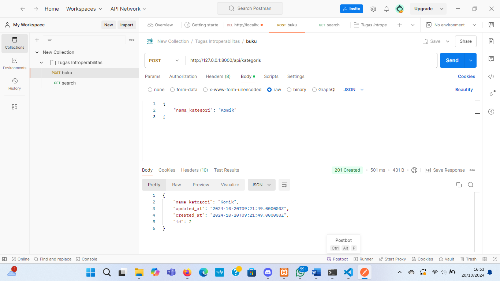
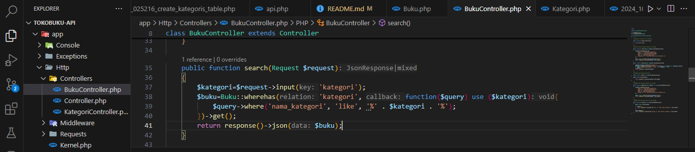
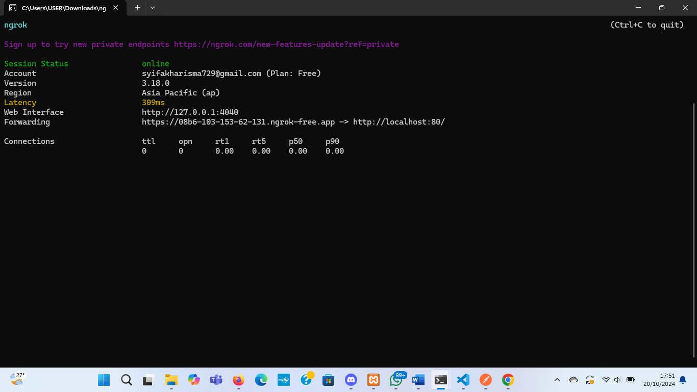
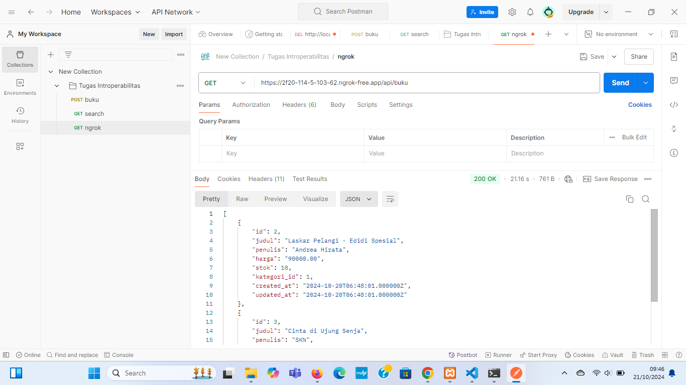

## PROJECT
Praktikum Interoperabilitas: Membuat API Toko Buku dengan Laravel 11 dan Testing Menggunakan Postman
Nama: Syifa Kharisma Nayla
NIM: 362358302019
Kelas: 2B TRPL

1.	Tambahkan Validasi:
o	Nama buku tidak boleh kosong.
o	Harga minimal Rp 1.00
Hasil:

2.	Rancang Endpoint Baru:
Buatlah satu endpoint tambahan untuk sistem toko buku, misalnya, endpoint untuk mencari buku berdasarkan kategori atau judul. 
Tantangan: Apa pertimbangan yang harus Anda buat saat merancang endpoint ini? Pertimbangkan aspek performa, skalabilitas, dan pengalaman pengguna.
Hasil:

3.	Uji API Secara Publik:
o	Gunakan ngrok atau sejenisnya untuk membuka API ke internet.
Hasil:

